

  

Parcelis (PAR-suhl-iss) is an open-source property management platform for landlords, small operators, and local property teams.

<h4 align="center">
  ,🚀
  <a href="http://kan.bn/dothuxv6abhw/parcelis-roadmap">Roadmap</a>
    &nbsp; &nbsp; &nbsp; · &nbsp; &nbsp; &nbsp;
  🧩
  <a href="https://github.com/parcelis/parcelis/discussions/categories/ideas">Request a feature</a>
  &nbsp; &nbsp; &nbsp; · &nbsp; &nbsp; &nbsp;
  🐞
  <a href="https://github.com/parcelis/parcelis/issues">Report a bug</a>
  &nbsp; &nbsp; &nbsp; · &nbsp; &nbsp; &nbsp;
  👥💬
  <a href="https://github.com/parcelis/parcelis/discussions">Community Discussions</a>
</h3>

 

&nbsp; &nbsp; &nbsp;

&nbsp; &nbsp; &nbsp;

 

     

## 
 Currently under development. Will update once we have a basic MVP to pilot.

  

# 🧩 Features

### Manage your portfolio in one place

Track properties, units, tenants, leases, maintenance, and income in a shared workspace—without relying on disconnected spreadsheets and tools.

### See your portfolio at a glance

Start with a dashboard for occupancy, properties, active leases, monthly rent, priority work, and a property snapshot.

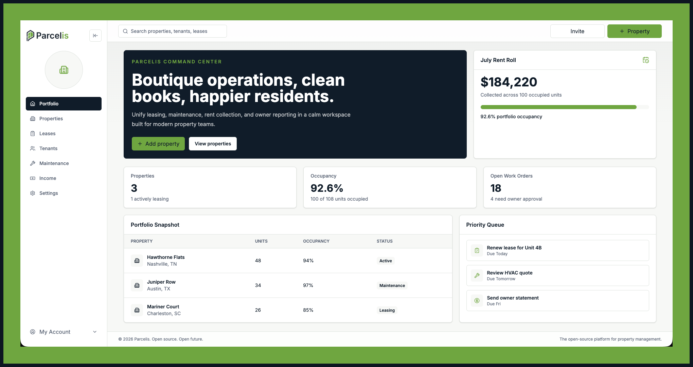

### Organize properties and units

Create and manage properties, units, contacts, tags, photos, notes, occupancy, and lease information. Archive records when they are no longer part of your active workflow without losing their history.

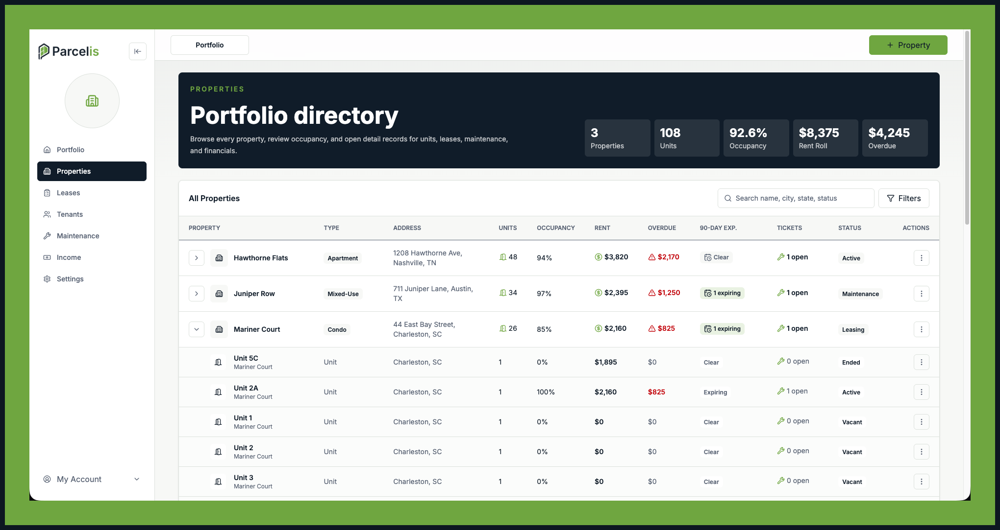
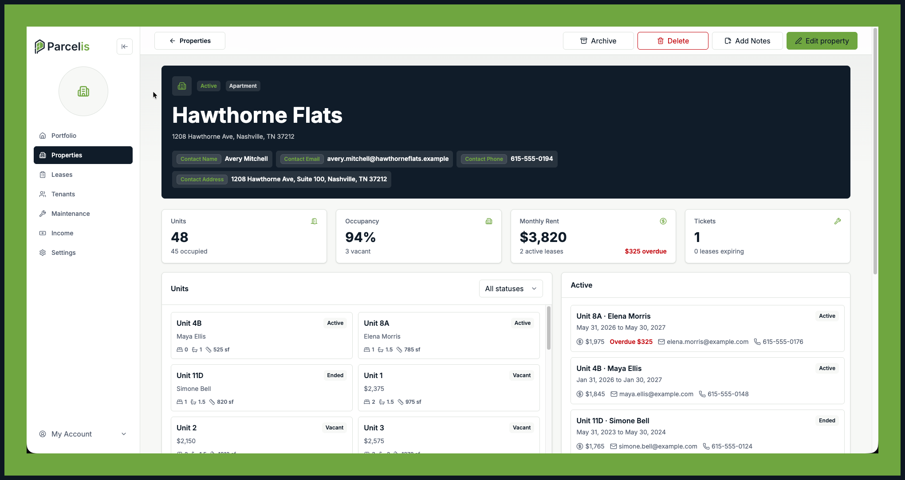
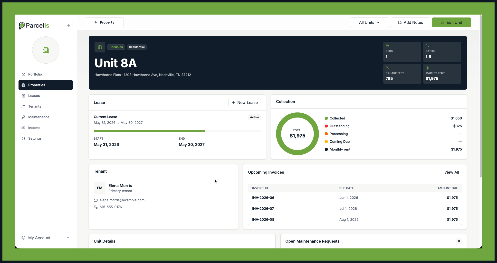

### Keep complete tenant records

Maintain tenant contact details, emergency contacts, insurance and account status, images, notes, lease history, current balances, and related invoices in one place.

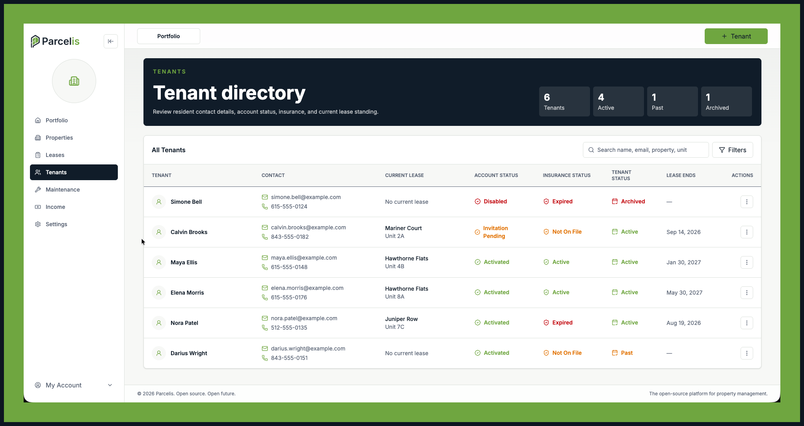
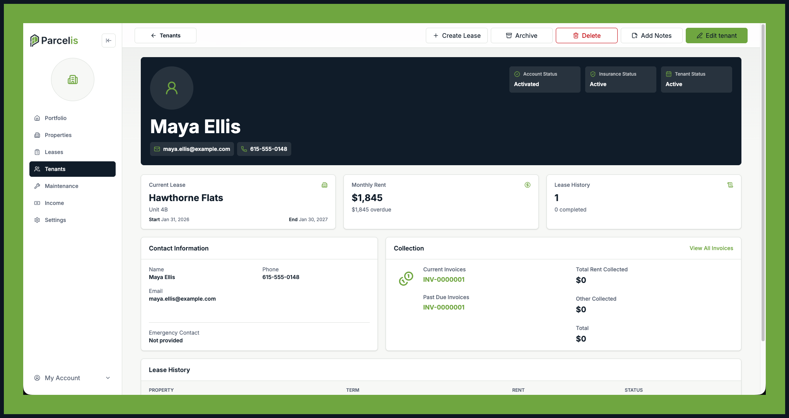

### Manage leases and rent income

Connect tenants to units with lease terms and monthly rent. Review rent roll and overdue balances, create itemized invoices, and record payments to keep income activity current.

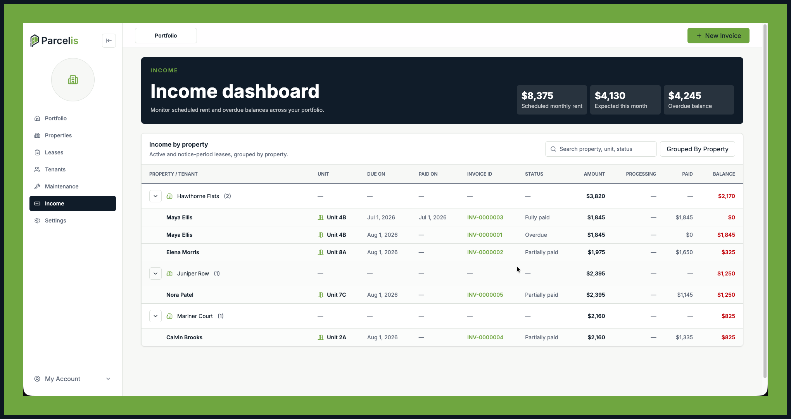
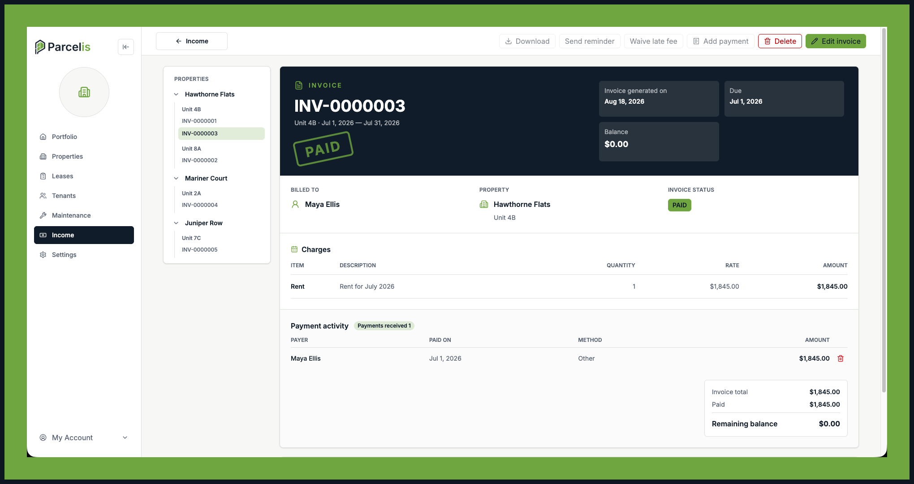

### Stay on top of maintenance

Create, search, filter, group, and manage maintenance tickets across your portfolio. Track priority, category, requester, unit, entry consent, photos, notes, and the full ticket lifecycle from new to closed or canceled.

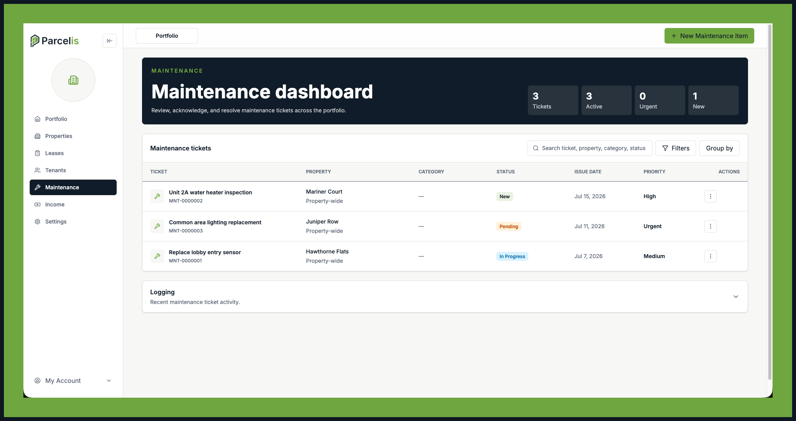
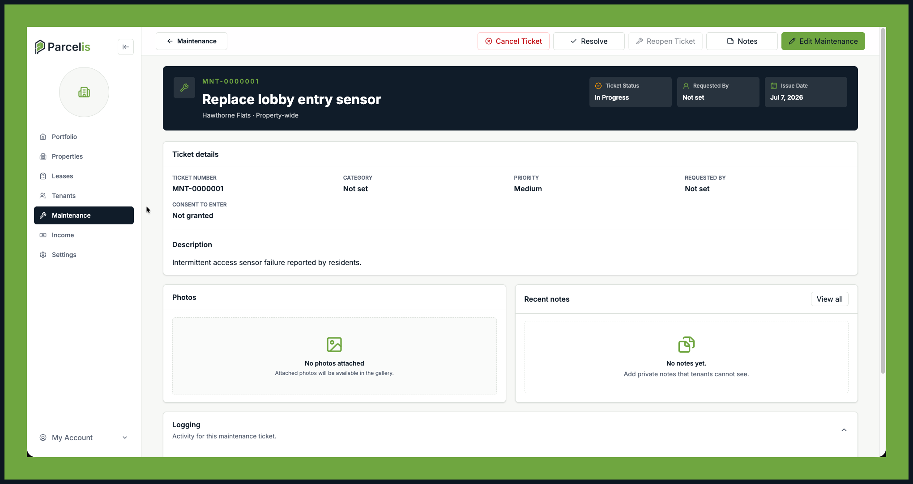
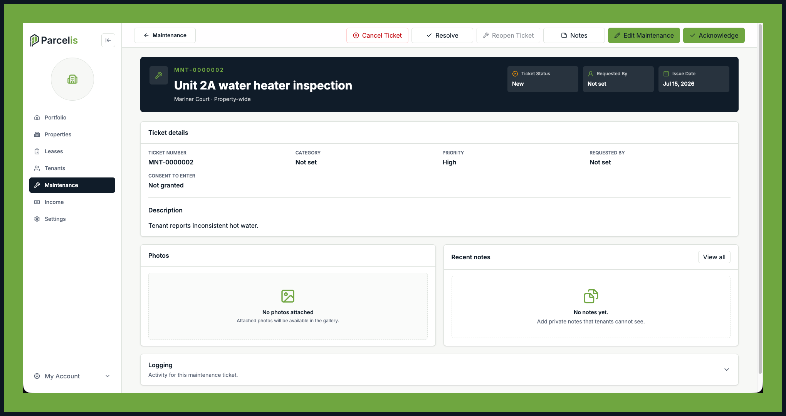

### Keep operational context attached to the work

Add internal notes to properties, tenants, and maintenance tickets so important details stay connected to the relevant record.

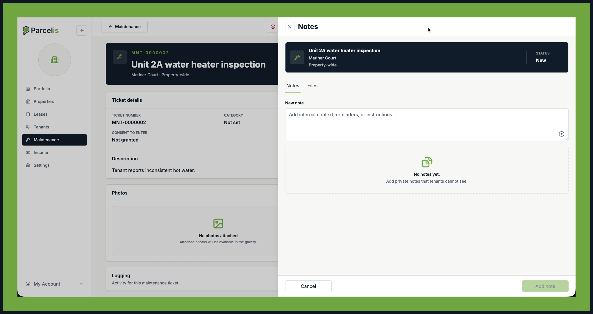
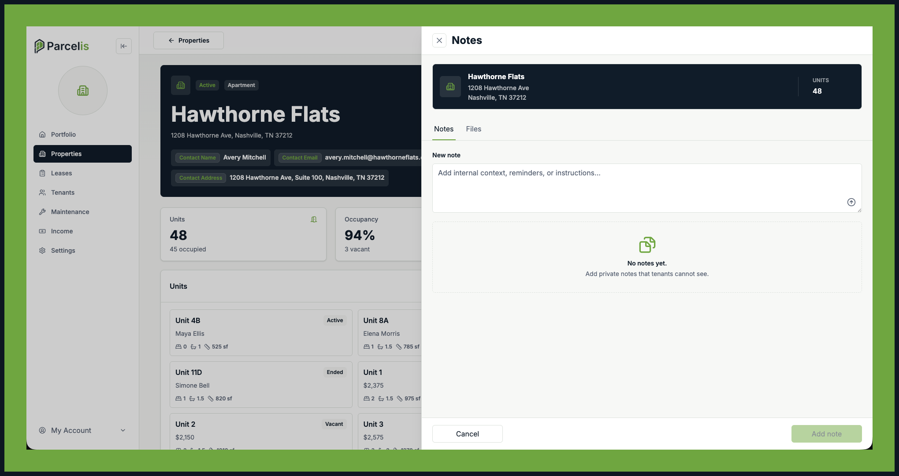
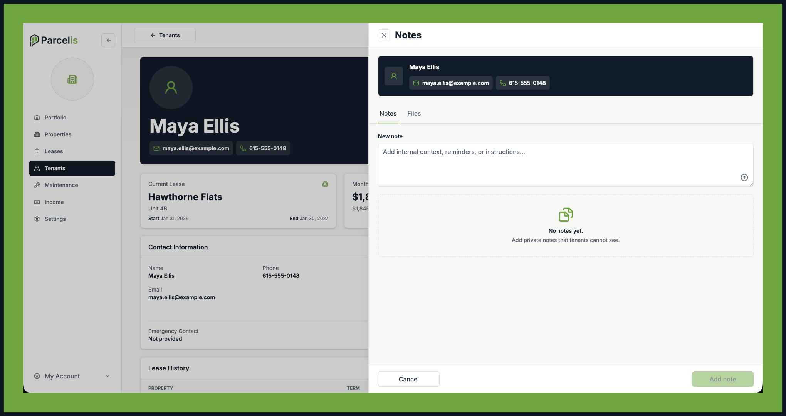

### Built for growing portfolios

Parcelis supports a consistent operating workflow whether you manage a few homes or a growing portfolio.

### Coming soon

- Tenant-facing online rent payments
- Non-maintenance requests, including move-in, access, and general tenant requests
- Keep properties, tenants, leases, invoices, and maintenance records separate by organization. Authorized users can switch between the organizations they can access.

Parcelis is an open-source operating system for rental teams—bringing portfolio, tenant, maintenance, lease, and income workflows into one place.

## Technology

Parcelis is built with open-source tools and services. See [DEPENDENCIES.md](DEPENDENCIES.md) for the maintained technology inventory and each tool's role.

### Tech Stack

---

  
  
  
  
  
  
  

| Area | Technology |
| --- | --- |
| Web app | [Next.js](https://nextjs.org/) and [React](https://react.dev/) |
| API | [NestJS](https://nestjs.com/), [Express](https://expressjs.com/), and [tRPC](https://trpc.io/) |
| Data and validation | [PostgreSQL](https://www.postgresql.org/), [Prisma](https://www.prisma.io/), and [Zod](https://zod.dev/) |
| Object storage | [MinIO](https://min.io/) with the S3-compatible AWS SDK |
| Interface | [Tailwind CSS](https://tailwindcss.com/), [Radix UI](https://www.radix-ui.com/), and [Lucide](https://lucide.dev/) |
| Documentation | [Docusaurus](https://docusaurus.io/) and [MDX](https://mdxjs.com/) |
| Tooling | [TypeScript](https://www.typescriptlang.org/), [pnpm](https://pnpm.io/), [Turborepo](https://turbo.build/), [ESLint](https://eslint.org/), and [Prettier](https://prettier.io/) |
| Local services and deployment | [Docker Compose](https://docs.docker.com/compose/) |

## Contributing

Every contribution is appreciated, from bug reports to pull requests. Before implementing a new feature or changing the API, please open an issue so the approach can be discussed first. See [CONTRIBUTING.md](CONTRIBUTING.md) for environment setup, contributor expectations, and the Conventional Commit format enforced for pull requests.

### Not sure where to start?

Browse [good first issues](https://github.com/parcelis/parcelis/labels/good%20first%20issue) for approachable contributions.

### How the repository is organized

Parcelis is a pnpm/Turbo monorepo. At a high level, it contains:

- [`apps/web`](apps/web): the main Parcelis web app.
- [`apps/api`](apps/api): the service that handles app data and requests.
- [`apps/docs`](apps/docs): the Parcelis documentation site.
- [`packages/ui`](packages/ui): reusable interface components and branding.
- [`packages/schemas`](packages/schemas): shared rules for validating app data.
- [`packages/db`](packages/db): database definitions, updates, and access code.
- [`packages/config`](packages/config): shared development-tool configuration.

For detailed local setup and contributor workflows, see [CONTRIBUTING.md](CONTRIBUTING.md).

## Licensing
Parcelis is licensed under the GNU Affero General Public License version 3. See
[LICENSING.md](LICENSING.md) for details.
 
 
 
 
## Thank you to our contributors!
Parcelis exists to push rental and property‑management software into a better future. Your involvement strengthens the platform and the community behind it. Thanks for helping shape what comes next.
 
 

