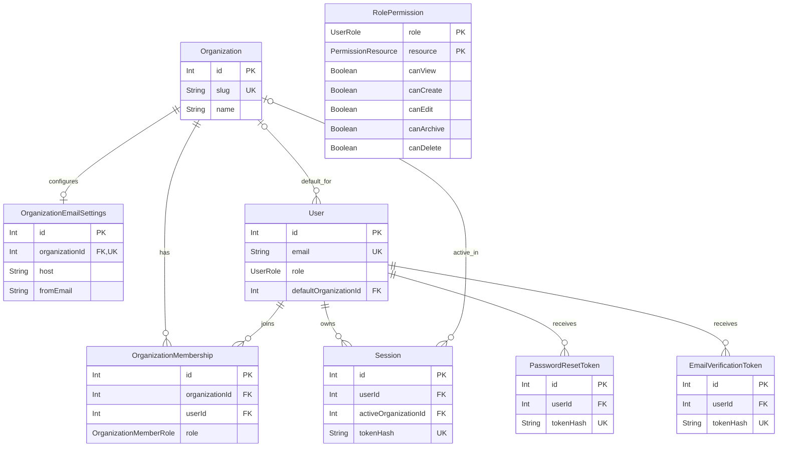
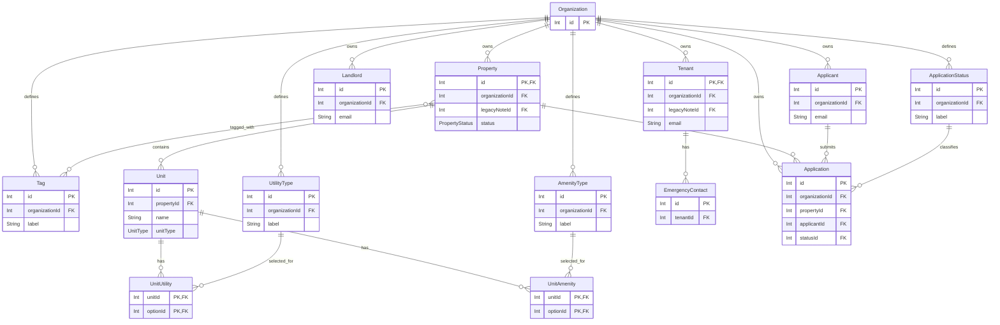
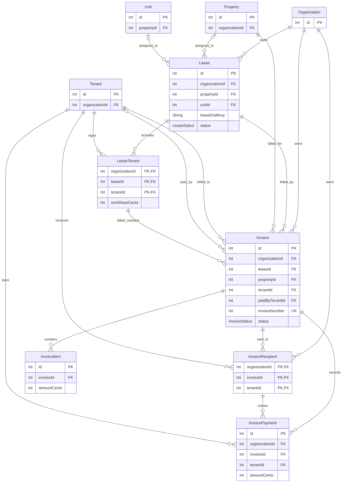
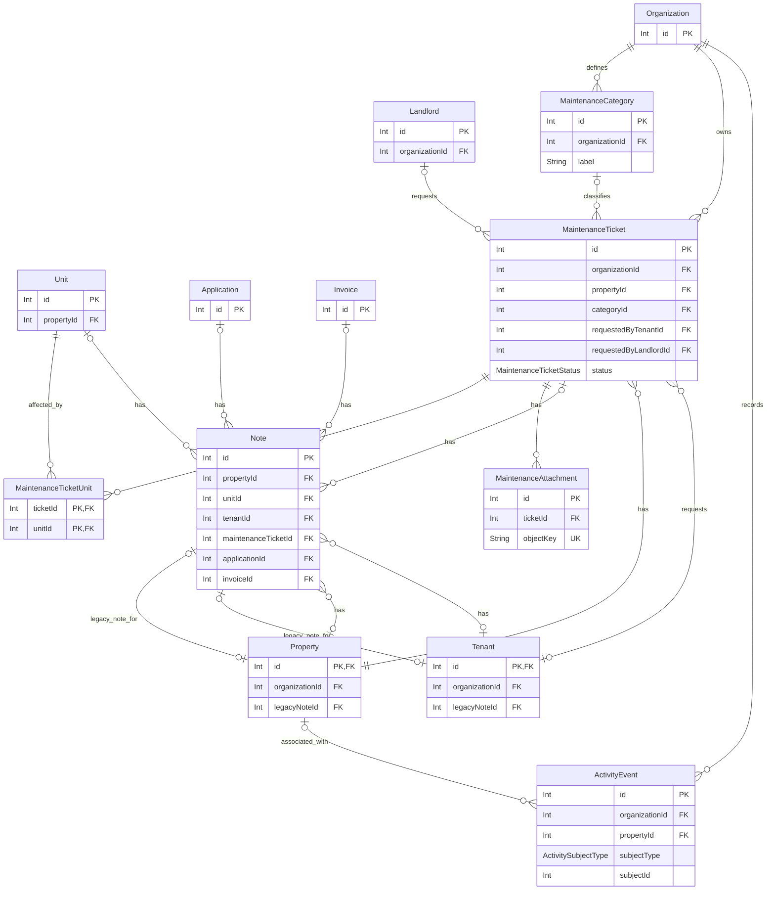
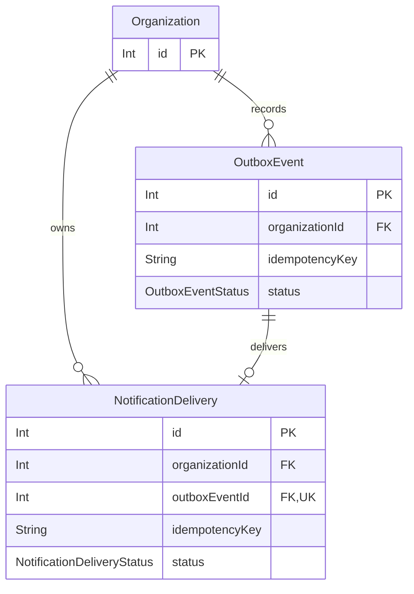

These diagrams describe the PostgreSQL data model in [`schema.prisma`](https://github.com/parcelis/parcelis/blob/main/packages/db/prisma/schema.prisma). They show primary keys, foreign keys, and selected fields that explain each relationship. The Prisma schema is the source of truth for every column, index, enum, and delete action.

[Download the editable Visio drawing](/diagrams/parcelis-database-erd.vsdx). It includes a complete overview followed by eight detail pages. The overview is also available as a [single-page Visio drawing](/diagrams/parcelis-database-erd-overview.vsdx) or a [PNG image](/diagrams/parcelis-database-erd-overview.png).

`PK` marks a primary key, `FK` a foreign key, and `UK` a unique key. A field can have more than one marker. A crow's foot means many; a circle means optional. Shared entities appear in more than one diagram so each area can be read on its own.

## Organizations and access

`OrganizationMembership` has a unique `(userId, organizationId)` pair. `RolePermission` has a composite `(role, resource)` primary key and no foreign key to `User`; `role` is a shared enum.

## Portfolio and applications

The Property–Tag many-to-many link is implicit in Prisma. `UnitUtility` and `UnitAmenity` are explicit join models with composite primary keys. Each application uses composite foreign keys with `organizationId` to keep its property, applicant, and status in the same organization. `Landlord` connects to maintenance requests in the next diagram.

## Leases and billing

Draft leases can have no property or unit. A lease's unit foreign key includes `propertyId`, so the selected unit belongs to the selected property. An invoice's composite lease foreign key includes `organizationId` and `propertyId`; its `LeaseTenant` foreign key also includes `tenantId`. A payment must match an `InvoiceRecipient` for its organization, invoice, and tenant.

## Maintenance, notes, and activity

The six nullable foreign keys on `Note` connect it to the corresponding record types. The schema does not constrain a note to exactly one parent. `Property.legacyNoteId` and `Tenant.legacyNoteId` are optional composite references back to a note belonging to that same record. `ActivityEvent.subjectType` and `subjectId` identify a subject in application data; `subjectId` is not a database foreign key. A ticket's requester can be a tenant or landlord; both requester foreign keys are optional in the schema.

## Outbox and notifications

The delivery's `(organizationId, outboxEventId)` foreign key requires its outbox event to belong to the same organization. Each outbox event has at most one delivery. Both tables also enforce organization-scoped idempotency keys.
